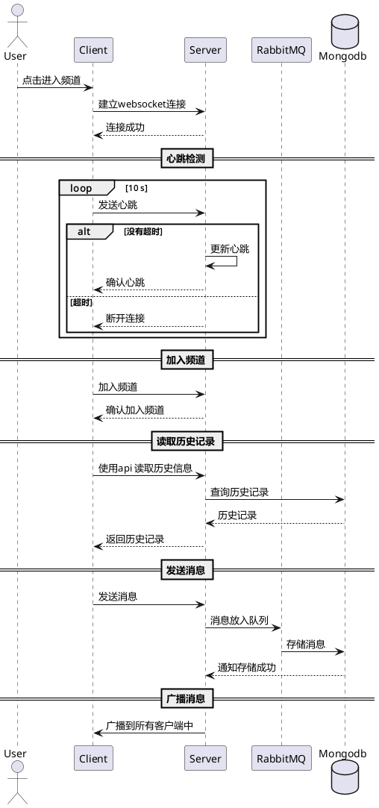
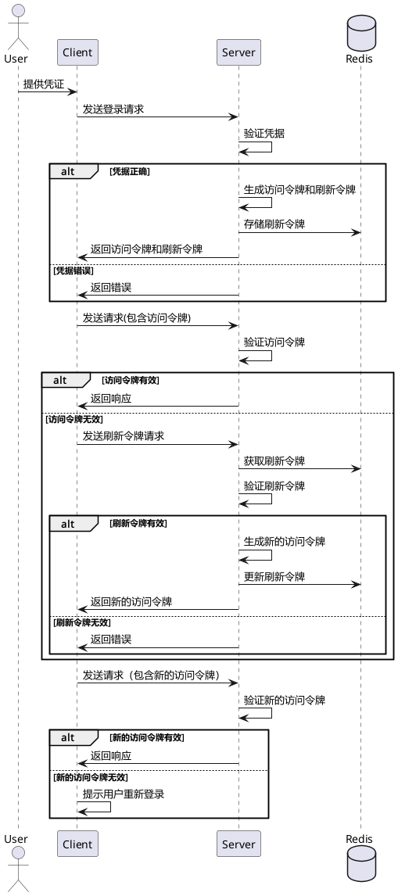

# 目标是做一个简单的discord的功能克隆

先从设计做起
打算使用的框架为 go gin redis mysql

先设计好再写

设计图片 目前只考虑了 信息 ，

打算考虑下 语音和视频

## 设计图

- [x] 添加验证码
- [x] 上传用户图片

- [ ] 聊天可以上传图片

- [ ] 构建一个聊天机器人

- [ ] 简单的log

- [ ] 语音聊天

- [ ] 在终端中使用

- [ ] 服务器权限设计
